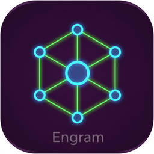
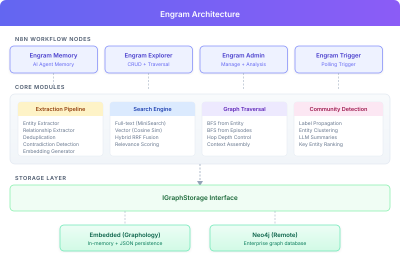

<p align="center">
  
</p>

<h1 align="center">n8n-nodes-engram</h1>

<p align="center">
  <strong>Knowledge graph memory for n8n AI agents</strong><br/>
  Persistent memory with entity extraction, temporal fact tracking, community detection, graph traversal, and hybrid search.
</p>

<p align="center">
  <a href="https://github.com/casistack/n8n-nodes-engram/actions/workflows/ci.yml">
    
  </a>
  <a href="https://www.npmjs.com/package/n8n-nodes-engram">
    
  </a>
  <a href="https://github.com/casistack/n8n-nodes-engram/blob/main/LICENSE">
    
  </a>
  
  
</p>

<p align="center">
  <a href="#installation">Installation</a> &middot;
  <a href="#node-reference">Nodes</a> &middot;
  <a href="#storage-backends">Storage</a> &middot;
  <a href="#knowledge-extraction">Extraction</a> &middot;
  <a href="#search">Search</a> &middot;
  <a href="#data-storage--security">Security</a> &middot;
  <a href="#development">Development</a>
</p>

---

> **Note:** This is a community node. It is not officially supported by n8n. Use at your own discretion.

---

## Overview

Engram gives your n8n AI agents a **knowledge graph memory**. Instead of losing context between conversations, agents build and query a persistent graph of entities (people, organizations, concepts) and the relationships between them.

Every conversation is stored as an episode. An optional LLM extraction pipeline identifies entities and facts from dialogue, building a growing knowledge graph. When the agent receives a new message, Engram searches the graph for relevant facts and injects them as context&mdash;giving the agent long-term memory that goes beyond simple chat history.

### Highlights

| | Feature | Description |
| --- | --- | --- |
| **4** | n8n Nodes | Memory, Explorer, Admin, Trigger |
| **2** | Storage Backends | Embedded (zero-setup) or Neo4j (production) |
| **5** | Extraction Stages | Entity, dedup, relationships, contradictions, embeddings |
| **3** | Search Modes | Full-text, vector, hybrid RRF fusion |
| **246** | Tests | Unit + integration across 26 test suites |

---

## Architecture

<p align="center">
  
</p>

---

## Installation

### Via n8n Community Nodes

1. Go to **Settings > Community Nodes** in your n8n instance
2. Enter `n8n-nodes-engram`
3. Click **Install**

### Manual

```bash
cd ~/.n8n
npm install n8n-nodes-engram
```

---

## Quick Start

### Minimal Setup (No LLM Required)

1. Add an **Engram Memory** node to your AI Agent workflow
2. Connect it to the agent's Memory input
3. Set **Storage Backend** to `Embedded (Graphology)`
4. Leave **Knowledge Extraction** as `Disabled`

Your agent now has persistent conversation history stored as episodic memory.

### Full Setup (With Extraction)

1. Create an **Engram Extraction LLM** credential:
   - **Base URL**: OpenAI-compatible endpoint (e.g. `https://api.openai.com/v1`)
   - **API Key**: Your API key
2. Add an **Engram Memory** node, enable **Knowledge Extraction**
3. Select an extraction model (e.g. `gpt-4o-mini`)
4. Optionally enable **Semantic Search (Embeddings)** with an embedding model
5. Optionally enable **Graph Traversal (BFS)** for context enrichment

The extraction pipeline automatically identifies entities and relationships from conversations and builds a queryable knowledge graph.

---

## Node Reference

### Engram Memory

> AI Memory node&mdash;connects to the AI Agent memory input.

On each conversation turn, Engram Memory:

- **Loads** relevant facts from the knowledge graph as system context, plus recent chat history
- **Saves** messages as episodes, optionally running the full extraction pipeline

| Setting | Description | Default |
| --- | --- | --- |
| Storage Backend | Embedded (Graphology) or Neo4j | Embedded |
| Knowledge Extraction | LLM-powered entity extraction | Disabled |
| Semantic Search | Vector embeddings for hybrid search | Disabled |
| Graph Traversal | BFS enrichment from matched entities | Disabled |
| Context Window | Recent turns to include | 10 |
| Max Facts per Query | Facts injected as context | 10 |
| Min Relevance Score | Threshold for inclusion (0&ndash;1) | 0.5 |
| Retention Policy | Episode lifecycle management | Forever |

### Engram Explorer

> Regular node&mdash;CRUD operations on the knowledge graph.

| Resource | Operations |
| --- | --- |
| **Entity** | Create, Get, Get by Name, List, Search, Update, Delete |
| **Relationship** | Create, Get, Get Between, Get for Entity, Search, Update, Delete, Get Changelog |
| **Episode** | Get, Get Recent, Get by Date Range, Get Count |
| **Traversal** | BFS from Entity, BFS from Episodes |

### Engram Admin

> Regular node&mdash;administration and analysis.

| Resource | Operations |
| --- | --- |
| **Monitoring** | Stats, List Groups, Group Stats, Diagnostics |
| **Lifecycle** | Apply Retention, Clear Group, Bulk Clear Groups, Clear All |
| **Hygiene** | Orphaned Entities, Duplicate Entities, Expire Stale Edges |
| **Portability** | Export, Import |
| **Analysis** | Detect Communities |

### Engram Trigger

> Polling trigger&mdash;fires when new entities, relationships, or episodes appear in the graph.

### Operational Diagnostics

Engram Admin includes a read-only **Monitoring > Diagnostics** operation for production checks. By default it returns quick storage and graph counts only. Optional deep checks scan the full graph to report embedding coverage, expired/invalidated edges, dangling edges, and duplicate entity-name groups.

---

## Storage Backends

| | Embedded (Graphology) | Neo4j |
| --- | --- | --- |
| **Setup** | Zero configuration | Requires Neo4j instance |
| **Persistence** | JSON file on disk | Neo4j database |
| **Vector search** | Brute-force cosine similarity | Brute-force cosine similarity |
| **Best for** | Development, single-instance | Production, multi-instance |
| **Scaling** | Single n8n instance | Independent of n8n lifecycle |

Both backends implement the same `IGraphStorage` interface. All features work identically on either backend.

---

## Knowledge Extraction

When enabled, the extraction pipeline processes each conversation turn:

```text
User message + AI response
        |
   Entity Extractor ── identifies people, orgs, locations, concepts
        |
   Entity Deduplicator ── merges "Bob Smith" with "Bob"
        |
   Relationship Extractor ── extracts facts ("Alice works at Acme")
        |
   Contradiction Detector ── flags conflicting facts
        |
   Embedding Generator ── (optional) vectors for semantic search
```

**Supported providers**: Any OpenAI-compatible API&mdash;OpenAI, OpenRouter, Ollama, LM Studio, Together AI, and others.

**Configurable entity types**: `person`, `organization`, `location`, `concept`, `event`, or custom types.

---

## Search

| Mode | Description | Requirements |
| --- | --- | --- |
| **Full-text** | Keyword search on names, summaries, and facts | None |
| **Vector** | Cosine similarity on embedding vectors | Embeddings enabled |
| **Hybrid RRF** | Reciprocal Rank Fusion combining text + vector | Embeddings enabled |

Hybrid search automatically activates when both text and vector search are available.

All search operations support optional **temporal filters** (`valid_after`, `valid_before`, `created_after`, `created_before`) to scope results by time.

---

## Temporal Queries

Engram tracks when facts are valid (`valid_at`, `invalid_at`) and when they were superseded (`expired_at`). You can query the graph by time:

| Operation | Node | Description |
| --- | --- | --- |
| **Get by Date Range** | Explorer > Episode | Retrieve episodes within a time window by `reference_time` |
| **Get Changelog** | Explorer > Relationship | Get recently created, expired, or invalidated relationships since a given date |
| **Search with date filters** | Explorer > Entity/Relationship Search | Filter search results by `valid_after`, `valid_before`, or `created_after` |

Date parameters use ISO 8601 format (e.g. `2026-01-15T00:00:00.000Z`). The LLM agent can convert natural language like "last week" into concrete dates before calling these operations.

---

## Community Detection

Clusters related entities using **label propagation**. Communities are computed on demand via **Engram Admin > Detect Communities** and include member entities, key entities ranked by connectivity, and optional LLM-generated summaries.

---

## Graph Traversal

BFS (breadth-first search) walks the knowledge graph outward from seed entities, collecting connected entities and relationships within a configurable hop limit.

- **BFS from Entity**: Start from specific entity UUIDs
- **BFS from Episodes**: Start from entities referenced in recent episodes
- **Automatic enrichment**: When enabled on the Memory node, a shallow BFS (default: 1 hop) runs after each search to enrich agent context

---

## Data Storage & Security

Engram stores conversation data and extracted knowledge. You should understand where this data lives before deploying to production.

**Embedded backend:**

- Data is stored as a JSON file at `~/.n8n/storage/n8n-nodes-engram/{workflowId}-engram.json` by default
- You can override the default with **Custom Storage Path** when using embedded storage
- The file contains all entities, relationships, episodes, and embeddings in plain text
- Backups: copy the JSON file

**Neo4j backend:**

- Data is stored in your Neo4j database instance
- Engram does not manage Neo4j authentication, encryption, or access control&mdash;configure these in Neo4j directly
- Credentials (URI, username, password) are stored in n8n's encrypted credential store

**LLM API calls:**

- When extraction is enabled, conversation content is sent to the configured LLM provider for entity/relationship extraction
- Embedding generation sends entity names and facts to the configured embedding model
- No data is sent to any external service unless you explicitly enable extraction and configure an API credential

**General:**

- Engram does not phone home, collect telemetry, or make network calls beyond the LLM API you configure
- All data stays on your infrastructure
- Group IDs isolate data between different conversations/users

---

## Credentials

### Engram Extraction LLM

| Field | Description |
| --- | --- |
| Base URL | OpenAI-compatible API base URL |
| API Key | API key for the LLM provider |

Used for entity extraction, community summaries, and embedding generation.

### Engram Neo4j Connection

| Field | Description |
| --- | --- |
| URI | Neo4j connection URI (e.g. `bolt://localhost:7687`) |
| Username | Neo4j username |
| Password | Neo4j password |
| Database | Database name (default: `neo4j`) |

Required only with the Neo4j storage backend.

---

## Development

### Prerequisites

- Node.js >= 18.10
- npm

### Setup

```bash
git clone https://github.com/casistack/n8n-nodes-engram.git
cd n8n-nodes-engram
npm install
```

### Commands

| Command | Description |
| --- | --- |
| `npm run build` | TypeScript compilation + icon build |
| `npm run lint` | ESLint |
| `npm run format` | Prettier (write) |
| `npm run format:check` | Prettier (check) |
| `npm run type-check` | TypeScript type checking |
| `npm test` | Run all tests |
| `npm run test:coverage` | Coverage report |

### Git Hooks (Husky)

| Hook | Checks |
| --- | --- |
| `pre-commit` | ESLint, Prettier, TypeScript type-check |
| `pre-push` | Build, full test suite |

### CI/CD

- **Pull requests**: Lint, type-check, test across Node 18/20/22
- **Releases**: Automated npm publish on GitHub Release

---

## Support

If you find Engram useful, consider supporting the project:

<a href="https://www.buymeacoffee.com/cassistack" target="_blank">
  
</a>

---

## License

[AGPL-3.0](LICENSE)
